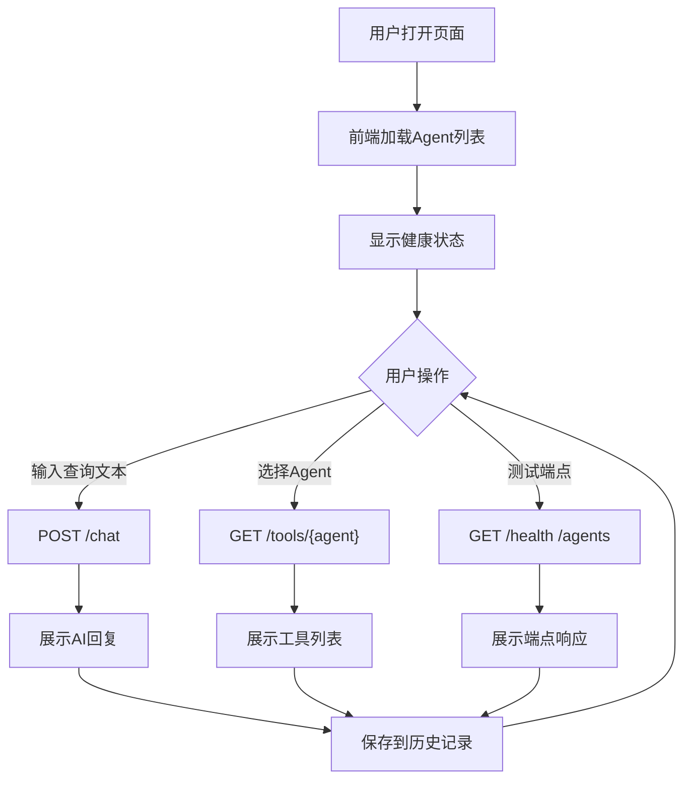

## 1. 产品概述

跨境电商多智能体系统前端交互界面，为用户提供可视化、友好的API交互方式，替代原有的终端命令行交互模式。用户可通过该界面直接与11个专业Agent（订单管理、物流追踪、客服等）进行对话，查看API返回结果，追溯历史交互记录。

- **目标用户**: 跨境电商运营人员、系统开发者、API测试人员
- **核心价值**: 降低多智能体系统使用门槛，提供直观的API调试和交互体验

## 2. 核心功能

### 2.1 功能模块

1. **对话交互面板**: 用户输入查询文本，提交至后端API，展示AI回复结果
2. **Agent选择器**: 下拉选择目标Agent，查看各Agent可用工具列表
3. **API端点浏览器**: 展示所有可用API端点，支持一键测试
4. **交互历史记录**: 保存并展示过往API调用记录，支持搜索和回看
5. **系统状态面板**: 实时显示API服务健康状态、Agent数量和工具统计

### 2.2 页面详情

| 页面名称 | 模块名称 | 功能描述 |
|---------|---------|---------|
| 主界面 | 侧边栏导航 | Agent列表展示，点击切换Agent上下文；显示API健康状态指示灯 |
| 主界面 | 对话输入区 | 文本输入框+发送按钮，支持Enter快捷发送；预设快捷查询模板 |
| 主界面 | 响应展示区 | Markdown渲染AI回复，结构化展示JSON数据（订单详情、物流信息等），支持折叠/展开 |
| 主界面 | 历史记录栏 | 右侧面板展示历史对话列表，支持搜索过滤、点击回看历史响应 |
| 主界面 | 错误提示区 | Toast通知组件，区分成功/错误/警告状态，自动消失 |
| 主界面 | 端点测试面板 | 可折叠面板展示所有API端点，点击发送测试请求，展示原始响应 |
| 主界面 | 状态栏 | 底部状态栏显示API连接状态、响应时间、当前Agent信息 |

## 3. 核心流程

## 4. 用户界面设计

### 4.1 设计风格

- **主题**: 深色科技风（Dark Tech），体现多智能体系统的专业感与未来感
- **主色调**: 深蓝黑背景(#0a0e17)，青色(#00d4aa)为主强调色，紫色(#7c3aed)为辅助色
- **按钮风格**: 圆角边框按钮，hover时发光边框效果，渐变背景
- **字体**: 标题使用"Orbitron"（科技感），正文使用"JetBrains Mono"（代码风格）
- **布局风格**: 三栏布局（左侧Agent导航 + 中间对话区 + 右侧历史记录）
- **图标风格**: 简约线条图标，青色单色风格

### 4.2 页面设计概览

| 页面名称 | 模块名称 | UI元素 |
|---------|---------|--------|
| 主界面 | 侧边栏 | 深色半透明玻璃态面板，Agent列表带状态指示灯，底部连接状态 |
| 主界面 | 对话区 | 居中布局，聊天气泡样式（用户右侧青色、AI左侧深灰），Markdown渲染 |
| 主界面 | 输入区 | 底部固定，圆角输入框带发光边框，发送按钮青色渐变 |
| 主界面 | 历史栏 | 右侧可折叠，列表项hover高亮，搜索框顶部固定 |
| 主界面 | 端点面板 | 可折叠卡片，代码块展示请求/响应JSON，一键复制按钮 |
| 主界面 | Toast通知 | 右上角弹出，渐入渐出动画，颜色区分类型 |

### 4.3 响应式设计

- 桌面端(>1024px): 三栏布局完整展示
- 平板端(768-1024px): 侧边栏折叠为汉堡菜单，历史栏可滑动隐藏
- 移动端(<768px): 单栏布局，底部Tab切换对话/历史/端点

## 5. API端点清单

| 方法 | 路径 | 描述 |
|------|------|------|
| GET | /health | 健康检查 |
| GET | /agents | 获取所有Agent列表 |
| GET | /tools/{agent_name} | 获取指定Agent的工具列表 |
| POST | /chat | 发送对话查询（body: {"query": "..."}） |