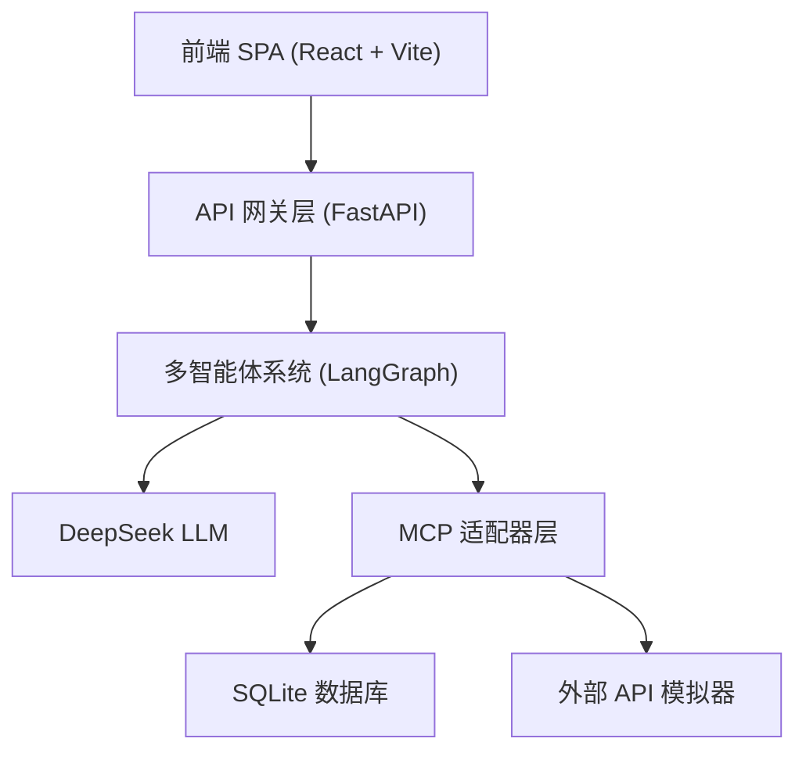
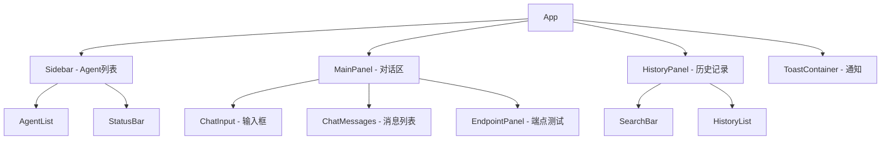

## 1. 架构设计



- **前端**: 纯静态SPA，通过HTTP与后端API通信，无需额外后端服务
- **后端API**: 已有FastAPI服务（localhost:7000），前端通过fetch调用
- **数据存储**: 历史记录使用浏览器localStorage，无需数据库

## 2. 技术描述

- **前端框架**: React 18 + TypeScript
- **样式方案**: Tailwind CSS 3
- **构建工具**: Vite
- **状态管理**: React Hooks (useState, useEffect, useContext)
- **HTTP客户端**: 原生 fetch API
- **Markdown渲染**: react-markdown
- **语法高亮**: prismjs
- **图标**: Lucide React
- **后端**: 已有FastAPI服务（无需新建）

## 3. 路由定义

| 路由 | 用途 |
|------|------|
| / | 主界面（对话交互 + Agent管理 + 端点测试） |

本项目为单页应用，所有功能集成在同一页面中，通过Tab/面板切换实现不同功能模块的访问。

## 4. API 定义

### 4.1 类型定义

```typescript
// Agent 信息
interface AgentInfo {
  name: string;
  description: string;
}

// 工具信息
interface ToolInfo {
  name: string;
  description: string;
  category: string;
  parameters: Record<string, unknown>;
  agent_name: string;
  timeout_seconds: number;
  requires_auth: boolean;
  tags: string[];
}

// 对话请求
interface ChatRequest {
  query: string;
  context?: Record<string, unknown>;
}

// 对话响应
interface ChatResponse {
  answer: string;
  expert_outputs: Record<string, unknown>;
  session_id: string;
}

// 健康检查响应
interface HealthResponse {
  status: string;
  timestamp: string;
}

// 历史记录
interface HistoryItem {
  id: string;
  query: string;
  response: ChatResponse;
  timestamp: string;
  duration: number;
}
```

### 4.2 API 请求/响应

| 端点 | 方法 | 请求体 | 响应体 |
|------|------|--------|--------|
| /health | GET | - | `{status, timestamp}` |
| /agents | GET | - | `{agents: AgentInfo[]}` |
| /tools/{agent} | GET | - | `{agent, tools: ToolInfo[]}` |
| /chat | POST | `{query, context?}` | `{answer, expert_outputs, session_id}` |

## 5. 组件架构



## 6. 数据模型

### 6.1 前端状态定义

```typescript
interface AppState {
  // API 连接
  apiBaseUrl: string;
  isConnected: boolean;
  responseTime: number;

  // Agent 数据
  agents: AgentInfo[];
  selectedAgent: string;
  agentTools: ToolInfo[];

  // 对话
  messages: Message[];
  isLoading: boolean;

  // 历史
  history: HistoryItem[];
  historySearch: string;
}
```

### 6.2 本地存储

历史记录使用 localStorage 持久化，key为 `ecommerce-agent-history`，最多保存100条记录。